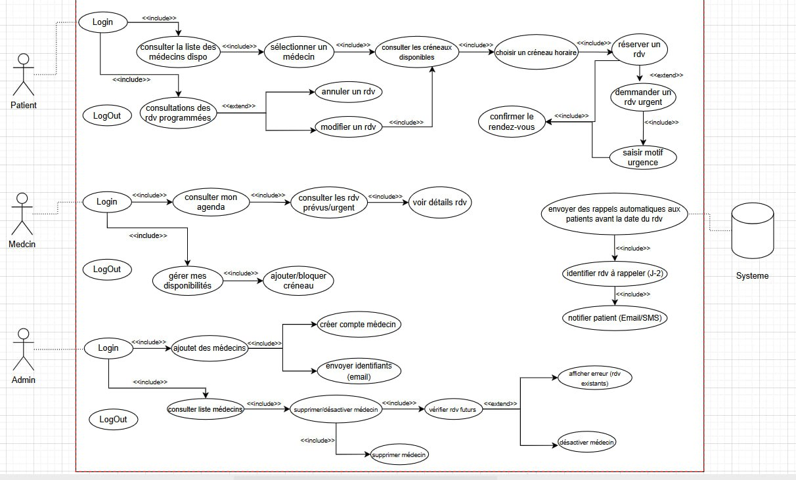
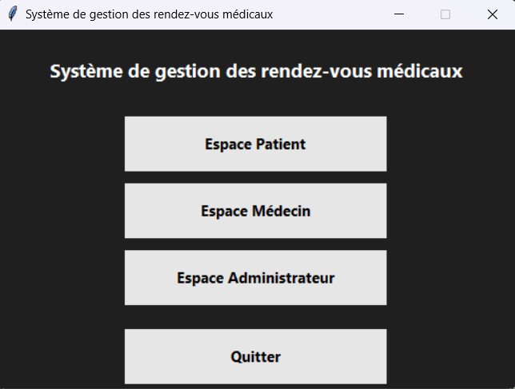
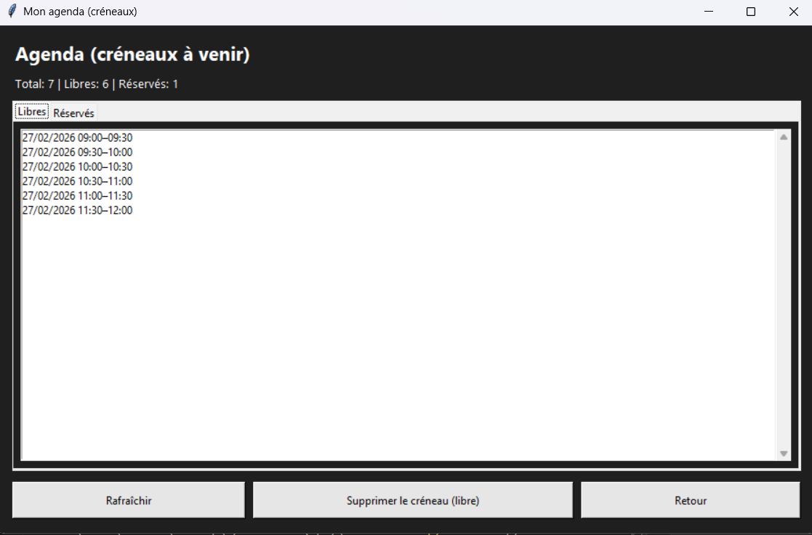
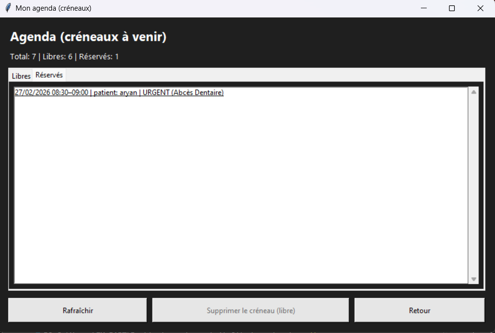
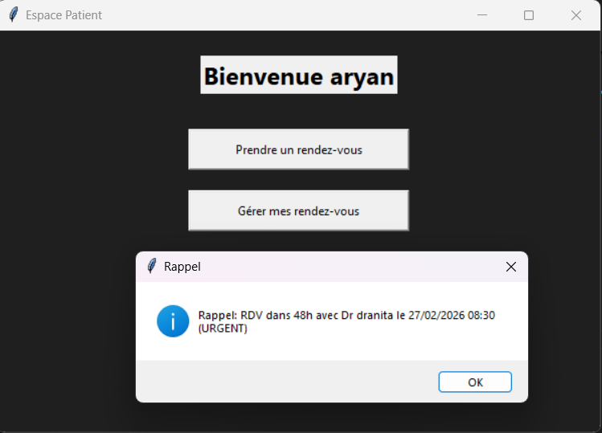
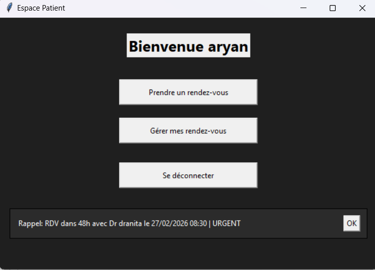
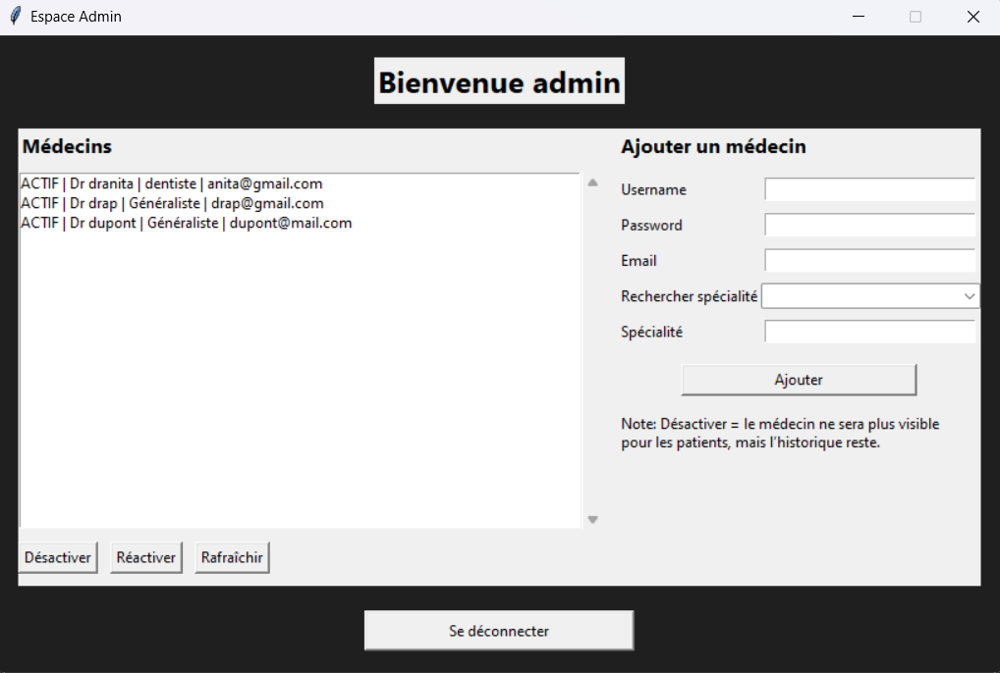
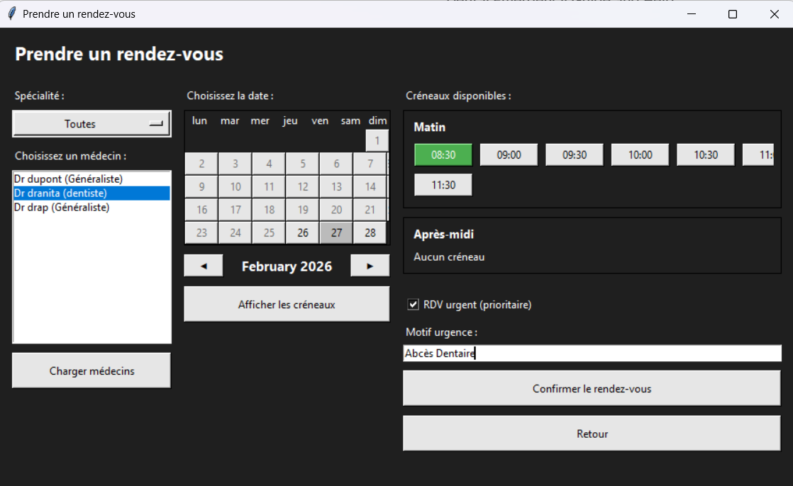

# RDV Medical (Tkinter + SQLite)

A desktop medical appointment management system built with **Python (Tkinter)** and **SQLite**.
It manages scheduling workflows between **Admin**, **Doctor (Médecin)**, and **Patient** using a modular layered architecture.

The system separates:

* **User Interface (Tkinter)**
* **Business Logic (Services layer)**
* **Data Access Layer (SQLite)**

---

## Features

### Authentication

* Secure login for Admin / Doctor / Patient
* Passwords stored securely using **hashing** (no plaintext storage)
* Patient self-registration
* Role-based access control

---

### Admin (Espace Admin)

* Create doctor accounts
* Assign speciality
* Activate / deactivate doctors
* Dynamic speciality filtering (Combobox)
* Soft deactivation (historical data preserved)

---

### Doctor (Espace Médecin)

* Create appointment slots (daily / weekly)
* Presets: Morning / Afternoon / Custom
* Prevent creating slots in past dates
* Agenda view:

  * **Free slots (Libres)** → can delete future free slots
  * **Reserved slots (Réservés)** → shows patient details
* Urgent appointment visualization
* Automatic filtering of upcoming appointments only

---

### Patient (Espace Patient)

* Browse doctors (with speciality filter)
* Interactive calendar (past dates disabled)
* Time slots filtering (past hours disabled for today)
* Book standard or urgent appointments
* Urgent booking requires justification
* Manage appointments (view / cancel / modify)
* Reminder system:

  * Popup alert on login (within 48h)
  * Visual reminder banner (48h window)

---

## Tech Stack

* Python 3
* Tkinter (GUI Framework)
* SQLite3 (Embedded Database)

---

## Project Structure

* `ui/` → Tkinter interface
* `services/` → Business logic (Auth, RDV, Admin)
* `data/` → Database layer
* `figures/` → UML diagrams
* `screenshots/` → Documentation images

This layered architecture improves modularity, maintainability, and scalability.

---

## Database

SQLite relational schema includes:

* `users`
* `creneaux` (appointment slots)
* `rdv` (appointments)

### Relationships

* One doctor → multiple slots
* One slot → zero or one appointment
* One patient → multiple appointments

---

## UML Diagram

This diagram illustrates the actors and use cases of the system.



---

## Screenshots

### Main Menu



### Doctor Agenda – Free Slots



### Doctor Agenda – Urgent Appointment



### Patient Reminder Popup



### Patient Reminder Banner



### Admin Panel



### Patient Booking



---

## Future Improvements

* Email notification service (SMTP integration)
* SMS notification system
* Full calendar grid view (monthly layout)
* Statistical dashboard (appointments per doctor / month)
* Responsive UI scaling
* REST API version (Flask / FastAPI backend)

---

## How to Run

1. Install Python 3
2. Run the application:

   ```bash
   python main.py
   ```
